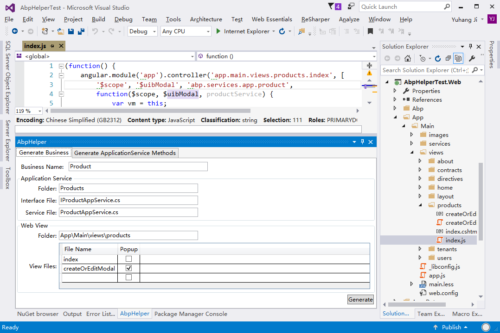
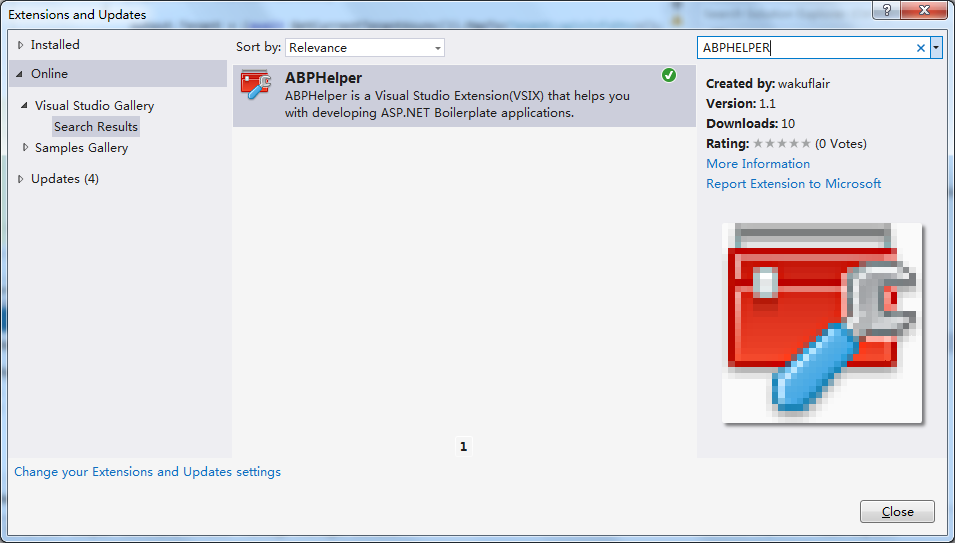
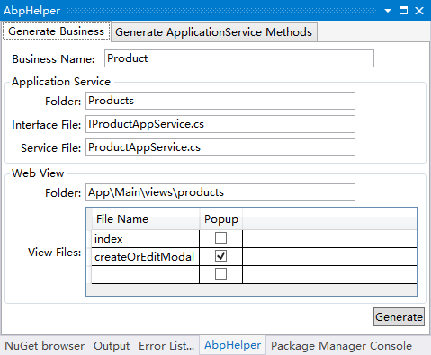
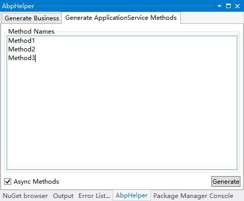

For [ABP vNext](https://abp.io/), see the new [AbpHelper](https://github.com/EasyAbp/AbpHelper.CLI).

# ABPHelper
ABPHelper is a Visual Studio Extension(VSIX) that helps you with developing [ASP.NET Boilerplate](https://aspnetboilerplate.com/) applications.

## Installation
You can install **ABPHelper** by using **Extensions and Updates** in Visual Studio. Or download it from [Visual Studio Gallery](https://visualstudiogallery.msdn.microsoft.com/15d33189-e63e-4ab4-9269-bc43200d7836) and install it manually.

## Using
Once you installed **ABPHelper**, you can find it in **Views**->**Other Windows**->**ABPHelper**.

**Features:**

- **Generate Business**

	In development using ABP, we usually need to create a group of related files: 

	Application project

	- IXXXAppService.cs, XXXAppservice.cs
	- Dto folder

	Web project

	- index.cshtml
	- index.js
	- other popups...

	I call this group of files "A business". Creating these files is trival and error-prone (maybe you forget to implement the ApplicationServiceBase, or you misspell the controller name).

	Use **Generate Business** to help you:

	

	- Input the business name, like `Product`, other info will be auto-genereated. You can also change them manually.
	- For folder fields, multi levels are supported.(like `TopFolder\SubFolder\Products`)
	- In `View Files`, you can add a row by inputing in the bottom row of the grid; you can remove a row by pressing the <kbd>DELETE</kbd> key.
	- then click **Generate** button(The first time generation maybe slow).
	
	**NOTE** AbpHelper will skip generating exist files/folders.

- **Generate ApplicationService Methods**

	Open an ApplicationService source code, then input methods names you want to generate in **Method Names** textbox(one name per line), check **Async Methods** if you wish.

	
	
	Then click **Generate** button, **ABPHelper** will do following things:

	- All methods will be generated in current ApplicationService class file. 
	- All methods will be generated in corresponding Interface file.
	- All DTO files will be created and added to `Dto` folder of current project. 
